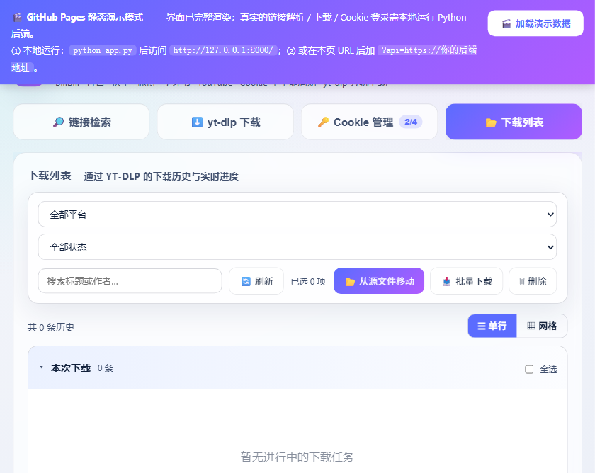
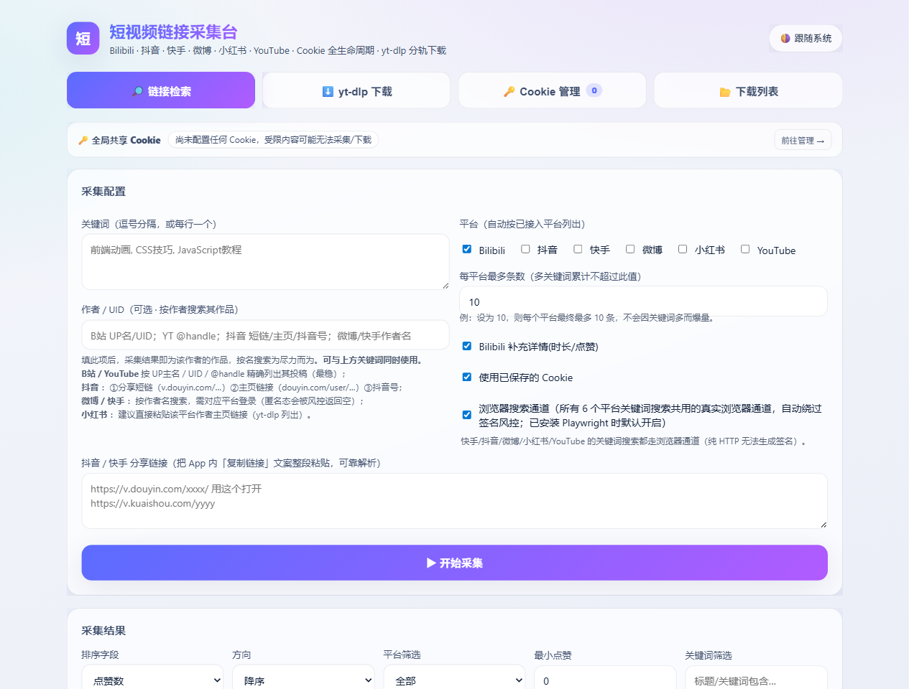
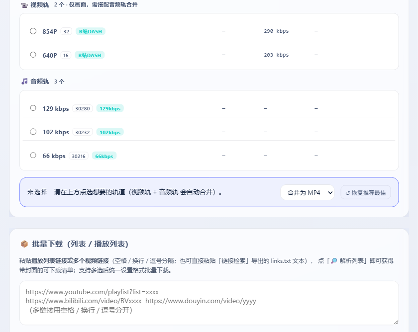
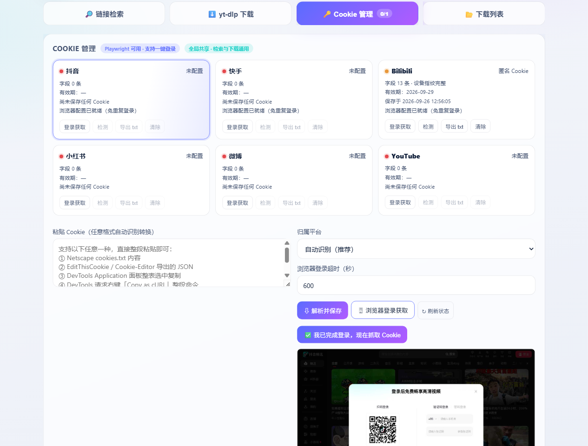

# VideoLinkCollector

> 多平台视频链接采集与下载工具 —— 将抖音 / 快手 / B站 / 小红书 / 微博 / YouTube 等平台的视频链接解析为无水印直链，支持批量下载、播放列表展开、画质与编码定制、结果导出与 Cookie 会话管理。

**技术形态**：Python 零框架后端（标准库 `http.server` + yt-dlp + Playwright）+ 原生 JavaScript 前端，无构建步骤；既可本机源码运行，也可部署至云服务器或静态托管于 GitHub Pages（演示模式）。

---

## 功能特性

- **多平台统一入口**：6 个平台共用同一套解析 / 下载接口，前端四大页签（链接检索、yt-dlp 下载、Cookie 管理、下载列表）覆盖完整工作流。
- **双通道抗反爬**：
  - *HTTP 直连通道* —— B站 WBI 签名、微博游客握手、快手 GraphQL，全部基于自研 HttpClient 与 Cookie 管理实现；
  - *真实浏览器通道* —— Playwright 驱动 Chromium 拦截 XHR/fetch 响应提取直链，配合连续空页计数与退避重试提升召回率。
- **无水印下载**：抖音直连优先取 `play_addr_h264` / `bit_rate` 无水印源，并对带水印源做 `watermark=1→0`、`/playwm/→/play/` 改写兜底。
- **B站官方 API 直连**：解析视频元数据（标题 / 作者 / 封面 / 时长 / 点赞 / 播放）与 **DASH 全轨道枚举**（各分辨率视频轨 + 各码率音频轨），绕过服务器数据中心 IP 的 412 风控；下载按所选轨道直连并自动 `ffmpeg` 合并为 MP4，无需经 yt-dlp 选轨。
- **B站歌单 / 合集自动展开**：粘贴合集、收藏夹、番剧、分P 链接自动展开为逐条视频。
- **作者 + 关键词组合检索（B站）**：由服务端做全量投稿过滤分页，非仅扫最新若干条。
- **批量下载**：多链接（空格 / 换行 / 逗号分隔，或检索导出的 `links.txt`）一次性解析并批量下载；批量解析阶段即通过服务器端浏览器通道获取标题、作者、封面与直链，列表立即可见真实信息。
- **画质与编码定制**：最高画质 / 1080p / 720p / 360p / 仅音频预设，H.264 / HEVC / AV1 / VP9 编码选择，mp4 / mkv / webm / mov / flv / avi 合并容器，自定义格式编号（如 `137+140`）。
- **Cookie 会话管理**：各平台网页内无头浏览器登录（扫码 / 验证码 / 密码），JPEG 截图实时回传前端；登录态仅存本机 `cookies/`。
- **结果后处理**：按平台 / 最低点赞 / 关键词筛选，按标题 / 点赞 / 时长排序，一键导出 Markdown / CSV / TXT 或复制链接清单。
- **去重与命名**：已下载地址自动跳过；文件命名统一为 `标题 - 作者 [时长].mp4`。

---

## 界面展示

> 下方截图分别来自 GitHub Pages 静态演示模式、云服务器真实后端、B站全格式解析、无头浏览器登录。

| GitHub Pages 静态演示模式 | 云服务器完整后端主界面 |
|---|---|
|  |  |

| B站全部音视频格式枚举 | 无头浏览器登录（截图回传） |
|---|---|
|  |  |

---

## 系统架构

```
video_crack/
├── app.py                   # 后端：HTTP 服务、路由、解析/下载编排
├── cookie_manager.py        # Cookie 加载/保存/Netscape 转换、浏览器登录状态机
├── frontend/                # 原生 JS 前端（index.html / app.js / style.css）
├── deploy/                  # 云服务器部署脚本与文档
├── docs/screenshots/        # 项目文档截图
├── cookies/                 # 各平台登录态（含 Playwright 浏览器 profile）
└── downloads/               # 下载输出目录
```

| 层次 | 技术选型 |
|---|---|
| 前端 | 原生 HTML / CSS / JavaScript（无框架、无构建） |
| 后端 | Python 标准库 `http.server` 路由 + 线程池任务编排 |
| 解析引擎 | yt-dlp（通用）、Playwright + Chromium（浏览器通道）、B站官方 API（WBI 签名） |
| 媒体处理 | ffmpeg（分轨合并 / 水印裁剪），缺失时自动降级 |
| 部署形态 | 本机源码运行 / PyInstaller 单文件 exe / systemd 云服务器 / GitHub Pages 静态演示 |

### 检索双通道

- **HTTP 直连**：B站 WBI 签名（`mixin_key` 重排 + MD5）、微博 `visitor` 网关握手、快手 GraphQL；
- **浏览器通道**：Playwright 打开真实搜索 / 视频页，拦截 XHR/fetch 响应提取直链，或滚屏抓取 DOM。

---

## 平台支持矩阵

| 平台 | 主要通道 | 登录要求 |
|---|---|---|
| B站 | 官方 API（WBI 签名）直连 | 无需（播放列表展开建议登录） |
| YouTube | yt-dlp | 无需 |
| 快手 | HTTP 直连（GraphQL） | 需要 |
| 小红书 | 浏览器通道 | 需要 |
| 微博 | HTTP 直连（游客握手） | 需要 |
| 抖音 | 浏览器直连（无水印） | **需登录** |

---

## 快速开始

```bash
pip install -r requirements.txt
playwright install chromium
python app.py        # 监听 http://127.0.0.1:8000/（端口占用自动顺延）
```

详细部署（腾讯云 systemd 服务、GitHub Pages 前后端分离、exe 打包）见 [`deploy/README_tencent.md`](deploy/README_tencent.md)。

---

## 已知限制与不足

- **平台风控为常态**：B站对数据中心 / 云服务器 IP 存在 412 硬风控，本项目以官方 API 通道绕行，但个别接口仍可能触发频率限制；抖音反爬升级频繁，无水印直链依赖播放器签名，偶发失败需重试或重新登录。
- **抖音下载依赖登录**：需先在 Cookie 管理页登录抖音账号，否则仅能获取元数据、无法下载。
- **无头登录交互受限**：服务器端登录为无头浏览器 + 截图回传，用户只能在截图区进行扫码 / 验证码操作，无法像本地浏览器一样直接点击页面元素（推荐扫码或粘贴 Cookie）。
- **HTTPS 缺失**：当前云服务器部署为 HTTP 站点，浏览器剪贴板 API（`navigator.clipboard`）在非安全上下文被禁用，前端已提供 `execCommand` 回退方案；同时 **不建议将 HTTP 无鉴权后端直接暴露公网**。
- **GitHub Pages 仅静态演示**：Pages 无法运行 Python 后端，线上演示页为内置演示数据模式，真实采集 / 下载需连接独立后端。
- **环境依赖**：浏览器通道依赖 Playwright + Chromium，分轨合并依赖 ffmpeg（缺失时降级为仅保存视频轨）。
- **小红书解析**：依赖浏览器通道且部分内容受登录态限制，成功率低于其余平台。
- **实验性功能**：B站水印裁剪（`delogo`）仅对静态 UID 角标有效，动态水印无法处理。

---

## 许可证

仅用于下载你有权获取的内容，请遵守各平台服务条款与当地法律法规。
